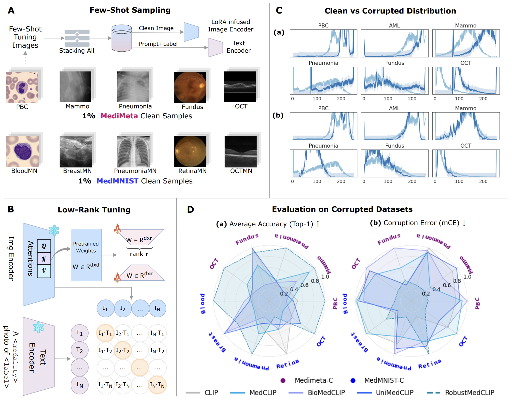

# RobustMedCLIP: Benchmarking and Improving the Robustness of Medical Vision-Language Models

> **Accepted at [Medical Image Understanding and Analysis (MIUA) 2025]**

[](LICENSE)
[](https://arxiv.org/abs/2505.15425)
[](https://github.com/BioMedIA-MBZUAI/RobustMedCLIP)
[](https://github.com/BioMedIA-MBZUAI/RobustMedCLIP)

---

## 🚀 Highlights

- 🧠 **MVLM Benchmarking**: Evaluate 5 major MVLMs across **5 modalities**, **7 corruption types**, and **5 severity levels**
- 📉 **Corruption Evaluation**: Analyze degradation under Gaussian noise, motion blur, pixelation, etc.
- 🔬 **MediMeta-C**: A new benchmark simulating real-world OOD shifts in high-res medical images
- 🧪 **Few-shot Robustness**: **RobustMedCLIP** uses just 1-10% of clean data for adaptation
- 🧠 **LoRA Efficient Tuning**: Low-rank fine-tuning in transformer attention layers

<p align="center">
  
</p>
<p align="center">
  Figure: Overview of the RobustMedCLIP pipeline: A) Few-shot Sampling of Clean Samples from MediMeta and MedMNIST across 5 modalities; B) Fine-tuning LoRA adapters using Few-shot samples; C) Distribution Shifts of MediMeta-C compared to Clean samples; D) Evaluation Results across Top-1 Accuracy and Corruption Error for 4 baselines and RobustMedCLIP.
</p>

---

## 🧬 Datasets

This project proposes MediMeta-C as corruption benchmark; and evaluates MVLMs on MedMNIST-C and MediMeta-C benchmarks.

| Dataset        | Modality         | Clean Samples | Corruption Sets | Resolution |
|----------------|------------------|----------------|------------------|-------------|
| **MediMeta-C** | Multi-modality   | 5 Modalities   | 7 corruptions × 5 levels | High-res |
| **MedMNIST-C** | Public Benchmark | 5 Modalities   | 7 corruptions × 5 levels | Low-res  |

Download links and API access: [MediMeta-C + MedMNIST-C](https://github.com/BioMedIA-MBZUAI/RobustMedCLIP)

---

## 📦 Installation

```bash
git clone https://github.com/BioMedIA-MBZUAI/RobustMedCLIP.git
cd RobustMedCLIP
conda create -n robustmedclip python=3.12.7
conda activate robustmedclip
pip install -r requirements.txt
````

---

## 🔧 Usage

### 1. Few-Shot Tuning

You can fine-tune RobustMedCLIP with either ViT or ResNet backbones:

```bash
# Fine-tune with ViT backbone (e.g., BioMedCLIP)
bash run_finetune_vit.sh

# Fine-tune with ResNet backbone (e.g., MedCLIP)
bash run_finetune_resnet.sh
```

---

### 2. Evaluation

Evaluate a fine-tuned or pretrained MVLM (including RMedCLIP):

```bash
# Evaluation for RobustMedCLIP (RMC)
bash run_eval_rmed.sh

# Generic evaluation (other baselines)
bash run_eval.sh
```

---

### 3. Custom Script Execution

Alternatively, run individual modules:

```bash
# Few-shot tuning (custom)
python finetune.py --model biomedclip --fewshot_ratio 0.1

# Evaluation (custom)
python evaluate.py --model_path outputs/rmc_biomedclip.pth --corruption benchmark
```

---

## 📊 Results

RobustMedCLIP consistently outperforms prior MVLMs under corruptions across all modalities:

| Model        | Clean Error ↓ | mCE ↓ (avg) |
| ------------ | ------------- | ----------- |
| CLIP         | 100.0         | 100.0       |
| MedCLIP      | 106.4         | 112.5       |
| BioMedCLIP   | 116.3         | 126.8       |
| UniMedCLIP   | 111.8         | 98.87       |
| **RMedCLIP** | **62.8**      | **81.0**    |

Detailed benchmarks available in `Results and Discussions`.

---

## 📂 Directory Structure

```bash
RobustMedCLIP/
│
├── data/                  # Datasets (clean + corrupted). Put downloaded data in this folder
├── models/                # MVLM architectures and LoRA modules
├── train_rmc.py           # Few-shot tuning script
├── evaluate.py            # Evaluation on corruption benchmarks
├── utils/                 # Helpers for preprocessing, metrics, etc.
├── assets/                # Figures, visualizations
└── README.md
```

---

## ✏️ Citation

If you find this repository helpful, please cite our paper:

```bibtex
@inproceedings{imam2025robustmedclip,
  title     = {On the Robustness of Medical Vision-Language Models: Are they Truly Generalizable?},
  author    = {Raza Imam and Rufael Marew and Mohammad Yaqub},
  booktitle = {Medical Image Understanding and Analysis (MIUA)},
  year      = {2025}
}
```

---

## 🤝 Acknowledgements

* Built on top of [BioMedCLIP](https://arxiv.org/abs/2303.00915) and [MedCLIP](https://arxiv.org/abs/2210.10163)
* MediMeta-C corruption designs are inspired by [ImageNet-C](https://arxiv.org/abs/1903.12261) and [MedMNIST-C](https://arxiv.org/abs/2406.17536)

For questions, contact: **[raza.imam@mbzuai.ac.ae](mailto:raza.imam@mbzuai.ac.ae)**

